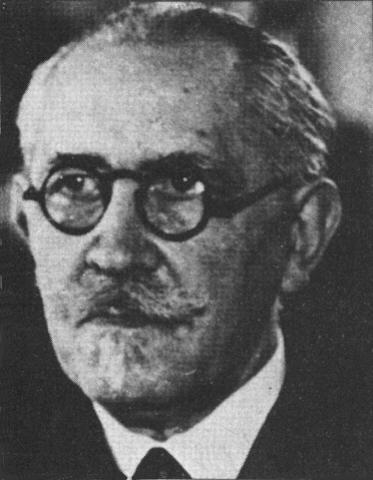

# Langevin Dynamics

## Applications in Machine Learning

Alma Ament

---

## From Newton to Langevin

<section style="position: relative; top: -50px;">
  <!-- Portraits positioned in the top-right corner -->
  

    
    
  

  <!-- Content columns -->
  

    

      <strong>Newtonian Mechanics</strong>
      <ul>
        <li>Smooth, deterministic motion</li>
        <li>Single trajectory per initial condition</li>
      </ul>
      $$
      \mathbf{F} = m\textbf{a} = m \frac{d^2 \mathbf{x}}{dt^2} = m\ddot{x}
      $$
      $$
      \begin{cases}
      \frac{d\mathbf{x}}{dt} = \mathbf{v}, \\
      \frac{d\mathbf{v}}{dt} = \frac{\mathbf{F}(\mathbf{x}, \mathbf{v}, t)}{m}
      \end{cases}
      $$
    

    

      <strong>Langevin Dynamics</strong>
      <ul>
        <li>Random, jittery motion</li>
        <li>Ensemble of possible paths</li>
      </ul>
      $$
      m \frac{d^2 x}{dt^2} = -\gamma \frac{dx}{dt} - \nabla U(x) + \eta(t)
      $$
      <ul>
      <li>$m$: mass of the particle</li>
      <li>$\gamma$: friction coefficient (damping)</li>
      <li>$U(x)$: potential energy</li>
      <li>$\eta(t)$: stochastic force with $\eta(t) \sim \mathcal{N}\left(0,\, 2D\,\delta(t-t')\right)$</li>
      </ul>
    

  

</section>

---

## Newtonian Mechanics vs Langevin Dynamics

  <video controls width="90%" style="max-width: 100%; height: auto; outline: none; border: none;" onclick="this.blur();">
    <source src="combined_dynamics_1.mp4" type="video/mp4">
    Your browser does not support the video tag.
  </video>

---

## Langevin Dynamics

  <video controls width="90%" style="max-width: 100%; height: auto; outline: none; border: none;" onclick="this.blur();">
    <source src="combined_dynamics_2.mp4" type="video/mp4">
    Your browser does not support the video tag.
  </video>

---

## Overdamped Langevin Dynamics

$$ m \ddot{x} = -\gamma \dot{x} - \nabla V(x) + \eta(t) $$

*  The frictional force ($-\gamma \dot{x}$) is **huge**
*  The inertial force ($m \ddot{x}$) is **negligibly small** in comparison

$$ m \ddot{x} \approx 0 \Rightarrow \gamma \dot{x} = -\nabla V(x) + \eta(t) $$

  

---

## Brownian Motion
