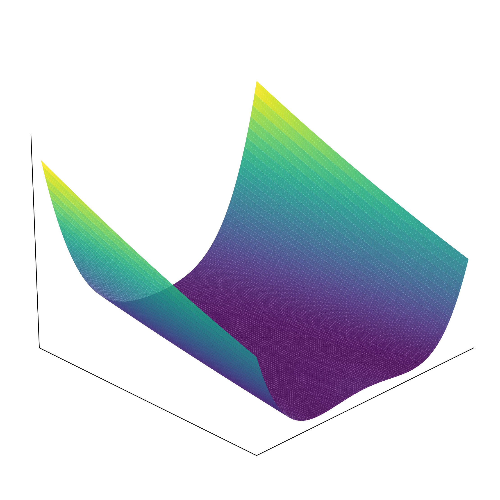
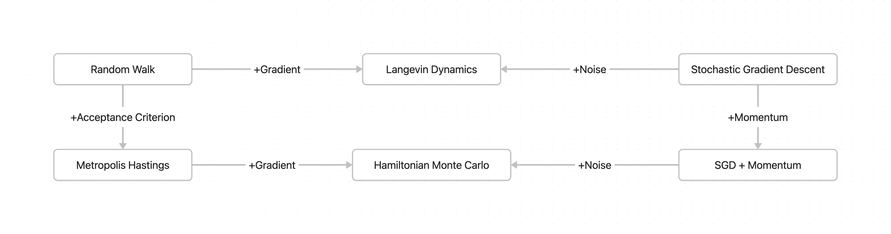

# Langevin Dynamics

## Applications in Machine Learning

Alma Ament

---

## The Big Picture

  

  
  

---

## Newtonian Mechanics and Langevin Dynamics

|  | Newtonian Mechanics | Langevin Dynamics | 
|--------|--------|----------|
| **Type** | Single path | Ensemble of possible paths | 
| **Equation** | $\mathbf{F} = m\mathbf{a}$, $m\ddot x = - \nabla U(x)$ | $m\ddot{x} = -\gamma\dot{x} - \nabla U(x) + \eta(t)$ | 
| **Randomness** | None | Thermal noise $\eta(t)$ | 
| **Time Evolution** | Continuous, smooth | Continuous, noisy |

---

## Newtonian Mechanics vs Langevin Dynamics

  <video controls width="90%" style="margin-top: -20px; max-width: 100%; height: auto; outline: none; border: none;" onclick="this.blur();">
    <source src="combined_dynamics_1.mp4" type="video/mp4">
    Your browser does not support the video tag.
  </video>

---

## Langevin Dynamics – Intuition

  <video controls width="90%" style="margin-top: -20px; max-width: 100%; height: auto; outline: none; border: none;" onclick="this.blur();">
    <source src="combined_dynamics_2.mp4" type="video/mp4">
    Your browser does not support the video tag.
  </video>

---

## Newtonian Mechanics vs Langevin Dynamics

  

---

## Langevin Dynamics

$$ m \ddot{x} = -\gamma \dot{x} - \nabla U(x) + \eta(t) $$

* $m \ddot x$: inertia of the particle
* $-\gamma \dot{x}$: $\gamma$ is the friction or damping coefficient
* $- \nabla U(x)$: the deterministic force acting on the particle derived from the potential energy function $U(x)$
* $\eta(t) \sim \mathcal{N}\left(0, 2\gamma k_B T \delta(t-t')\right)$: the stochastic force or thermal noise

---

## Over-damped Langevin Dynamics

*  The frictional force $-\gamma \dot{x}$ is **huge**
*  The inertial force $m \ddot{x}$ is **negligibly small** in comparison

$$ m \ddot{x} \approx 0 \Rightarrow \gamma \dot{x} = -\nabla U(x) + \eta(t) $$

* The system has no inertial "memory"
* Also known as **Langevin Diffusion**

  
  

---

## Machine Learning and Physical Systems

Given a probability density $p(x)$ we can define the **potential energy function** as:

$$U(x)=- \log p(x)$$

* Principle of Maximum Entropy
* Boltzmann Distribution

In Practice, we rather use

$$U(\theta)=- \log p(\theta | x_{1:n}) = - \log p(\theta | \mathcal{D})$$

---

## Newtonian Mechanics – Frequentist ML

Learning defined as **Empirical Risk Minimization** (Optimization)

$$\theta^*=\arg\min_{\theta\in\Theta} U(\theta)=\arg\min_{\theta\in\Theta} -\log(\theta|\mathcal{D})$$

Solution via **Gradient Descent**:

$$\theta^{(n+1)} = \theta^{(n)} -\alpha \nabla U(\theta) $$

---

## Langevin Dynamics – Bayesian ML

Learning defined as **Sampling from the Posterior** given the training data:

$$p(\theta|\mathcal{D}) \propto p(\mathcal{D}|\theta)p(\theta)$$

Simulating samples via **Unadjusted Langevin Algorithm**:

$$\theta_{t+1} = \theta_t - \epsilon_t \nabla U(\theta_t) + \sqrt{2\epsilon_t} Z_t, \text{with } Z_t \sim \mathcal{N}(0, I)$$

ULA is a discretization of the Langevin diffusion using the **Euler-Maruyama** method:

$$
\lim_{\epsilon_t \to 0} q_t(\theta) = p(\theta | \mathcal{D})
$$

---

## Properties of ULA

* ✅ Captures uncertainty in learned parameters

* ✅ Inherently resistant to overfitting

* ❌ Impractical / Infeasible for large datasets

* ❌ Update step requires computation over the whole dataset

* ❌ Requires significantly more steps than GD (~20x)

* ❌ Known negative result for Bayesian Online Learning (Particle Degeneracy – Andrieu et al. 1999)

$\implies$ Stochastic Gradient Langevin Dynamics (SGLD)

---

## Stochastic Gradient Langevin Dynamics

We approximate the gradient with mini-batch gradients. At each iteration $t$, the parameters are updated as:

$$\theta_{t+1} = \theta_t + \Delta\theta_t$$

Where the update $\Delta\theta_t$ is defined by the core SGLD formula:

$$\Delta \theta_t = - \epsilon_t \nabla \tilde{U}(\theta_t) + \sqrt{2\epsilon_t} Z_t, \text{with } Z_t \sim \mathcal{N}(0, I)$$

* Noisy gradient: $\nabla \tilde{U}(\theta_t)$
* Injected Gaussian Noise: $\sqrt{2\epsilon_t} Z_t$

--

## SGLD – Update Rule in Detail

$$
U(\theta)=- \log p(\theta | \mathcal{D}) \text{ with } p(\theta|\mathcal{D}) \propto p(\mathcal{D}|\theta)p(\theta)
$$

$$
U(\theta)\propto - \log p(\theta) - \sum_i^N \log p(y_{t_i}|\theta)
$$

$$
- \nabla U(\theta_t) =  \nabla \log p(\theta_t) + \frac{N}{n} \sum_{i=1}^{n} \nabla \log p(y_{t_i} | \theta_t)
$$

$$
\Delta \theta_t = \frac{\epsilon_t}{2} \left( \nabla \log p(\theta_t) + \frac{N}{n} \sum_{i=1}^{n} \nabla \log p(y_{t_i} | \theta_t) \right) + \eta_t, \text{with } \eta_t \sim\mathcal{N}(0, \epsilon_t)
$$

---

## SGD vs SGLD

  <video controls width="80%" style="margin-top: -30px; max-width: 100%; height: auto; outline: none; border: none;" onclick="this.blur();">
    <source src="sgd_vs_sgld.mp4" type="video/mp4">
    Your browser does not support the video tag.
  </video>

---

## Guarantee for Convergence

For SGLD to converge to the true posterior:
$q_t(\theta) \longrightarrow p(\theta|Y) \quad \text{as} \quad t \to \infty  $

The step size schedule must satisfy the **Robbins-Monro Conditions**:
$$
\sum_{t=1}^{\infty} \epsilon_t = \infty \quad \text{and} \quad \sum_{t=1}^{\infty} \epsilon_t^2 < \infty
$$

Then $q_t$ evolves according to the **Fokker-Planck Equation**:

$$\frac{\partial q_t}{\partial t} = \nabla \cdot (q_t \nabla U ) + \Delta  q_t$$

---

## The Benefits of SGLD

* **Scalable Bayesian Learning**: Enables Bayesian inference on large datasets by avoiding full gradient computations (Welling, Teh 2011)

* **Seamless Transition**: Automatically shifts from optimization to posterior sampling

* **Anytime Results**: As an "anytime" algorithm, it provides usable samples throughout the process, even if stopped early

---

## Exploration vs Exploitation

**Initial Phase (Large $\epsilon_t$) – Optimization (Burn-in)**
*   The gradient term $- \epsilon_t \nabla \tilde{U}(\theta_t)$ dominates.
*   The algorithm behaves like SGD, rapidly moving towards areas of high probability (low potential energy).

**Final Phase (Small $\epsilon_t$) – Sampling**
*   The injected noise $\sqrt{2\epsilon_t} Z_t$ becomes comparable to the gradient step.
*   The algorithm ceases to converge to a single point and instead starts exploring the region around the minimum.

After crossing the **Sampling Threshold** we can save every few steps and use them as a **Bayesian Ensemble** 

---

## Limitations of SGLD

* **Tuning Sensitivity:** The step size schedule requires careful and often difficult tuning

* **Isotropic Noise:** The assumption of uniform Gaussian noise $\mathcal{N}(0, I)$ can slow down convergence

* **Discretization Error:** The use of discrete steps introduces a bias in the final distribution

---

## Step Size Schedules

**Polynomial Schedule**
$$
\epsilon_t = a(b+t)^{-\gamma}
$$
*   **$a$ (scale):** Controls the initial step size
*   **$b \geq 0$ (stability):** Stabilizes initial iterations
*   **$\gamma \in (0.5, 1]$ (decay rate):** Controls how quickly the step size decreases

**Cosine Annealing Schedule**

$$
\epsilon_t = \epsilon_{\text{min}} + \frac{1}{2} (\epsilon_{\text{max}} - \epsilon_{\text{min}}) \left[ 1 + \cos\left( \frac{\pi * \mathrm{mod}(t-1, T)}{T} \right) \right]
$$

---

## Step Size Schedules

  <video controls width="80%" style="margin-top: -30px; max-width: 100%; height: auto; outline: none; border: none;" onclick="this.blur();">
    <source src="step_size_schedules.mp4" type="video/mp4">
    Your browser does not support the video tag.
  </video>

---

## Preconditioning

  

The preconditioned SGLD update becomes:
$$
\Delta \theta_t = - \epsilon_t G(\theta_t)^{-1} \nabla \tilde{U}(\theta_t) + \sqrt{2\epsilon_t G(\theta_t)^{-1}} Z_t
$$

*   $G(\theta_t)$ is a positive definite matrix that captures the local geometry of the potential $U(\theta)$
*   A common choice is a diagonal matrix based on the running average of squared past gradients (similar to RMSprop).
*   This allows for larger steps in "flat" directions and smaller, more cautious steps in "steep" directions, leading to much faster mixing.

---

## Metropolis Adjusted Langevin Algorithm

MALA corrects the discretization error and guarantees **exact convergence** to the posterior. At each iteration $t$:

1.  **Langevin Proposal:** Same as ULA

$$
\theta' = \theta_t - \frac{\epsilon_t}{2} \nabla U(\theta_t) + \sqrt{\epsilon_t}Z_t, \quad Z_t \sim \mathcal{N}(0, I)
$$
    
2.  **Metropolis-Hastings Correction:** 

$$
\alpha = \min\left(1, \frac{p(\theta'|\mathcal{D}) q(\theta_t|\theta')}{p(\theta_t|\mathcal{D}) q(\theta'|\theta_t)}\right)
$$

---

## Ignoring the MH Step in SGLD

**Computational Cost:** Calculating the acceptance probability $\alpha$ requires evaluating the full posterior $p(\theta|\mathcal{D})$ at both $\theta_t$ and $\theta'$.
$$
p(\theta'|\mathcal{D}) \propto p(\theta') \prod_{i=1}^N p(y_i|\theta')
$$

**High Acceptance Probability** as $\epsilon_t\rightarrow 0$ 

$$
\alpha(\theta_t, \theta') = \min \left( 1, \frac{p(\theta'|\mathcal{D}) q(\theta_t | \theta')}{p(\theta_t|\mathcal{D}) q(\theta' | \theta_t)} \right)\rightarrow 1
$$

---

## Other Methods

  

---

## References

Welling, Teh (2011), Bayesian Learning via Stochastic Gradient Langevin Dynamics

Xifara et al, (2013) Langevin diffusions and the Metropolis-adjusted Langevin algorithm

Garriga-Alonso, Fortuin (2020), Exact Langevin Dynamics with Stochastic Gradients

Goodsell, Hanson (1976), Almost Sure Convergence for the Robbins–Monro Process

Jaynes (1957), Information theory and statistical mechanics