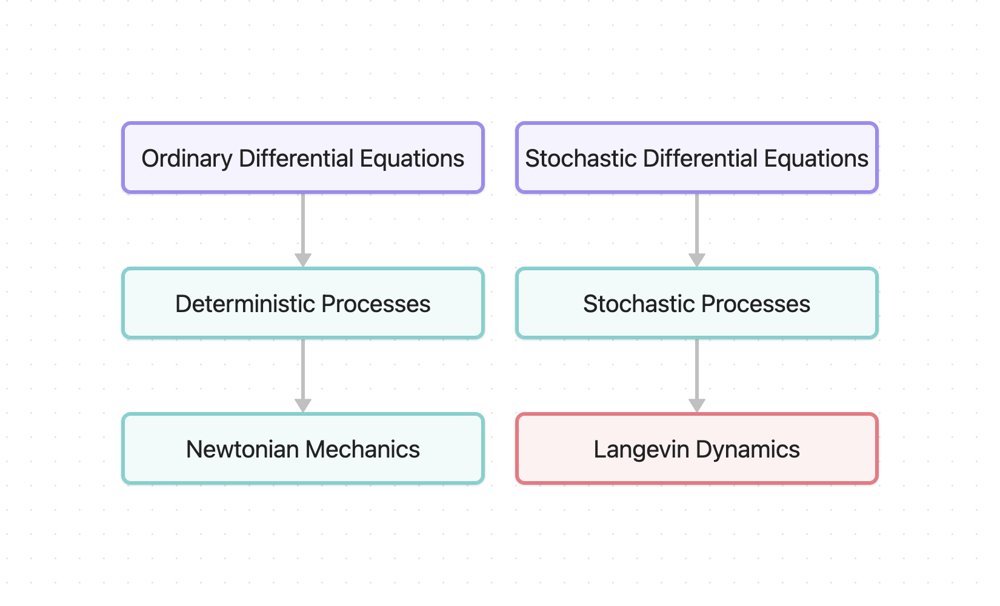
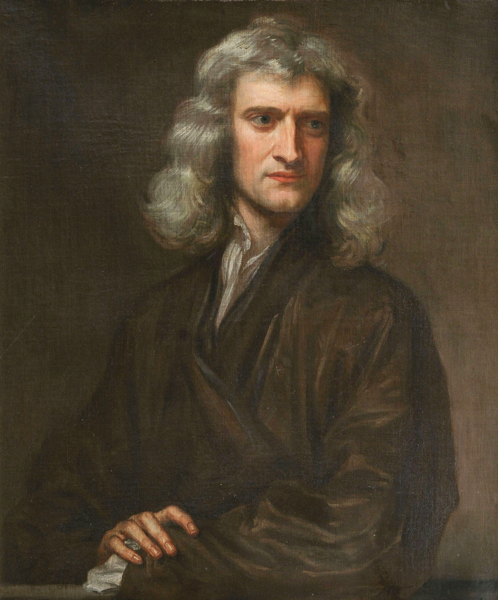
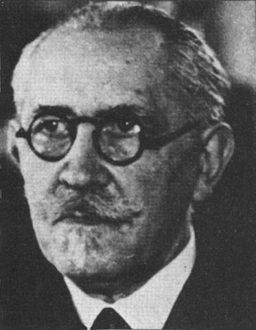
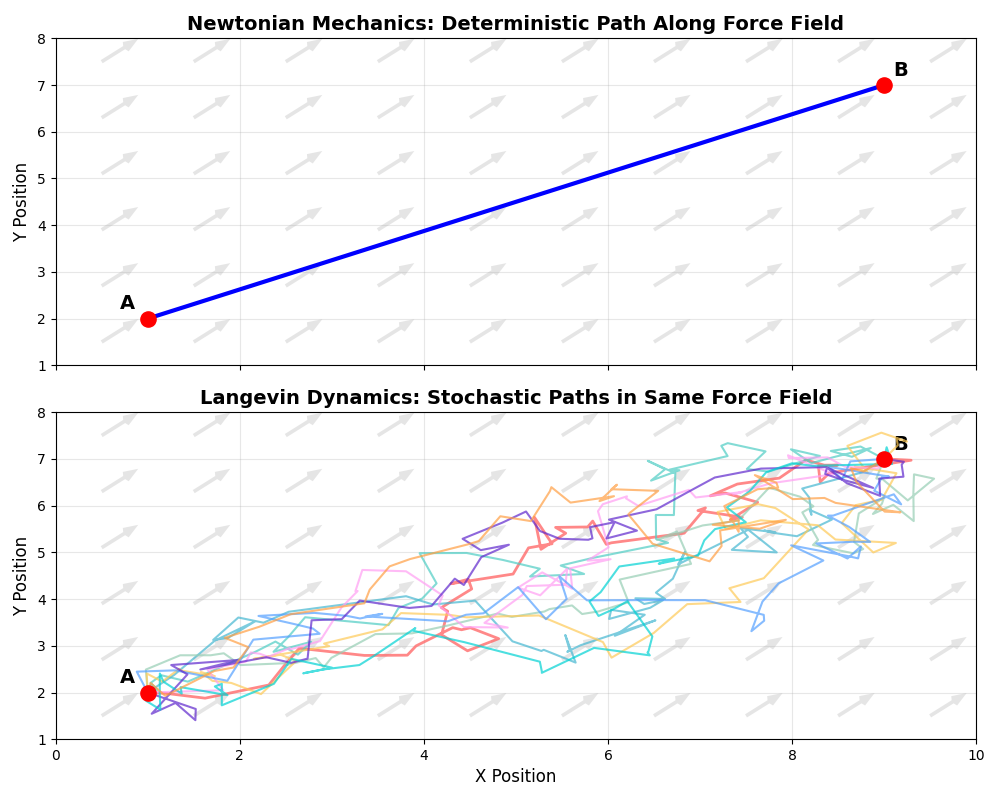

# Langevin Dynamics

## Applications in Machine Learning

Alma Ament

---

## The Big Picture

  

  
  

---

## Newtonian Mechanics and Langevin Dynamics

|  | Newtonian Mechanics | Langevin Dynamics | 
|--------|--------|----------|
| **Type** | Single path | Ensemble of possible paths | 
| **Equation** | $\mathbf{F} = m\mathbf{a}$, $m\ddot x = - \nabla U(x)$ | $m\ddot{x} = -\gamma\dot{x} - \nabla U(x) + \eta(t)$ | 
| **Randomness** | None | Thermal noise $\eta(t)$ | 
| **Time Evolution** | Continuous, smooth | Continuous, noisy |

---

## Newtonian Mechanics vs Langevin Dynamics

  <video controls width="90%" style="margin-top: -20px; max-width: 100%; height: auto; outline: none; border: none;" onclick="this.blur();">
    <source src="combined_dynamics_1.mp4" type="video/mp4">
    Your browser does not support the video tag.
  </video>

---

## Langevin Dynamics – Intuition

  <video controls width="90%" style="margin-top: -20px; max-width: 100%; height: auto; outline: none; border: none;" onclick="this.blur();">
    <source src="combined_dynamics_2.mp4" type="video/mp4">
    Your browser does not support the video tag.
  </video>

---

## Newtonian Mechanics vs Langevin Dynamics

  

---

## Langevin Dynamics

$$ m \ddot{x} = -\gamma \dot{x} - \nabla U(x) + \eta(t) $$

* $m \ddot x$: inertia of the particle
* $-\gamma \dot{x}$: $\gamma$ is the friction or damping coefficient
* $- \nabla U(x)$: the deterministic force acting on the particle derived from the potential energy function $U(x)$
* $\eta(t) \sim \mathcal{N}\left(0, 2\gamma k_B T \delta(t-t')\right)$: the stochastic force or thermal noise

---

## Over-damped Langevin Dynamics

*  The frictional force $-\gamma \dot{x}$ is **huge**
*  The inertial force $m \ddot{x}$ is **negligibly small** in comparison

$$ m \ddot{x} \approx 0 \Rightarrow \gamma \dot{x} = -\nabla U(x) + \eta(t) $$

* The system has no inertial "memory"
* Also known as **Langevin Diffusion**

  
  

---

## Machine Learning and Physical Systems

Given a probability density $p(x)$ we can define the **potential energy function** as:

$$U(x)=- \log p(x)$$

* Principle of Maximum Entropy
* Boltzmann Distribution

In Practice, we rather use

$$U(\theta)=- \log p(\theta | x_{1:n})$$

---

## Newtonian Mechanics – Frequentist ML

Learning defined as **Empirical Risk Minimization** (Optimization)

$$\theta^*=\arg\min_{\theta\in\Theta} U(\theta)=\arg\min_{\theta\in\Theta} -\log(\theta|\mathcal{D})$$

Solution via **Gradient Descent**:

$$\theta^{(n+1)} = \theta^{(n)} -\alpha \left. \nabla U(\theta)\right|_{\theta=\theta^{(n)}} $$

---

## Langevin Dynamics – Bayesian ML

Learning defined as **Sampling from the Posterior** given the training data:

$$p(\theta|\mathcal{D}) \propto p(\mathcal{D}|\theta)p(\theta)$$

Simulating samples via **Langevin Monte Carlo**:

$$\theta_{t+1} = \theta_t - \epsilon_t \nabla U(\theta_t) + \sqrt{2\epsilon_t} Z_t, \text{with } Z_t \sim \mathcal{N}(0, I)$$

LMC is a discretization of the Langevin diffusion using the **Euler-Maruyama** method:

$$
\lim_{\epsilon_t \to 0} \lim_{t \to \infty} q_t(\theta) = p(\theta | \mathcal{D})
$$

---

## Properties of Langevin Monte Carlo

* ✅ Captures uncertainty in learned parameters

* ✅ Inherently resistant to overfitting

* ❌ Impractical / Infeasible for large datasets

* ❌ Update step requires computation over the whole dataset

* ❌ Requires significantly more steps than GD (~20x)

* ❌ Known negative result for Bayesian Online Learning (Particle Degeneracy – Andrieu et al. 1999)

$\implies$ Stochastic Gradient Langevin Dynamics (SGLD)

---

## SGLD – Update Rule

We approximate the gradient with mini-batch gradients. At each iteration $t$, the parameters are updated as:

$$\theta_{t+1} = \theta_t + \Delta\theta_t$$

Where the update $\Delta\theta_t$ is defined by the core SGLD formula:

$$\Delta \theta_t = - \epsilon_t \nabla \tilde{U}(\theta_t) + \sqrt{2\epsilon_t} Z_t, \text{with } Z_t \sim \mathcal{N}(0, I)$$

* Noisy gradient: $\nabla \tilde{U}(\theta_t)$
* Injected Gaussian Noise: $\sqrt{2\epsilon_t} Z_t$

---

## SGLD – Update Rule in Detail

$$
U(\theta)=- \log p(\theta | \mathcal{D}) \text{ with } p(\theta|\mathcal{D}) \propto p(\mathcal{D}|\theta)p(\theta)
$$

$$
U(\theta)\propto - \log p(\theta) - \sum_i^N \log p(y_{t_i}|\theta)
$$

$$
- \nabla U(\theta_t) =  \nabla \log p(\theta_t) + \frac{N}{n} \sum_{i=1}^{n} \nabla \log p(y_{t_i} | \theta_t)
$$

$$
\Delta \theta_t = \frac{\epsilon_t}{2} \left( \nabla \log p(\theta_t) + \frac{N}{n} \sum_{i=1}^{n} \nabla \log p(y_{t_i} | \theta_t) \right) + \eta_t, \text{with } \eta_t \sim\mathcal{N}(0, \epsilon_t)
$$

---

## Guarantee for Convergence

For SGLD to converge to the true posterior:
$q_t(\theta) \longrightarrow p(\theta|Y) \quad \text{as} \quad t \to \infty  $

The step size schedule must satisfy the **Robbins-Monro Conditions**:
$$
\sum_{t=1}^{\infty} \epsilon_t = \infty \quad \text{and} \quad \sum_{t=1}^{\infty} \epsilon_t^2 < \infty
$$

Then $q_t$ evolves according to the **Fokker-Planck Equation**:

$$\frac{\partial q_t}{\partial t} = \nabla \cdot (q_t \nabla U ) + \Delta  q_t$$

---

## The Benefits of SGLD

* Guarantee for convergence without full batch gradient computations $\rightarrow$ Unlocks Bayesian Learning for large scale datasets (Welling, Teh 2011)

* Smoothly and automatically transitions from stochastic optimisation to sampling from the posterior

* It is an **Anytime Algorithm**

---

## SGD vs SGLD

---

## Limitations of SGLD

---

## Comparison of Step Size Schedules

---

## Sampling threshold

---

## Preconditioning

---

## Metropolis-Hastings Acceptance Criterion

---

## Ignoring the MH Step

---

## Metropolis Adjusted Langevin Algorithm

---

## The Big Picture

---

## References
