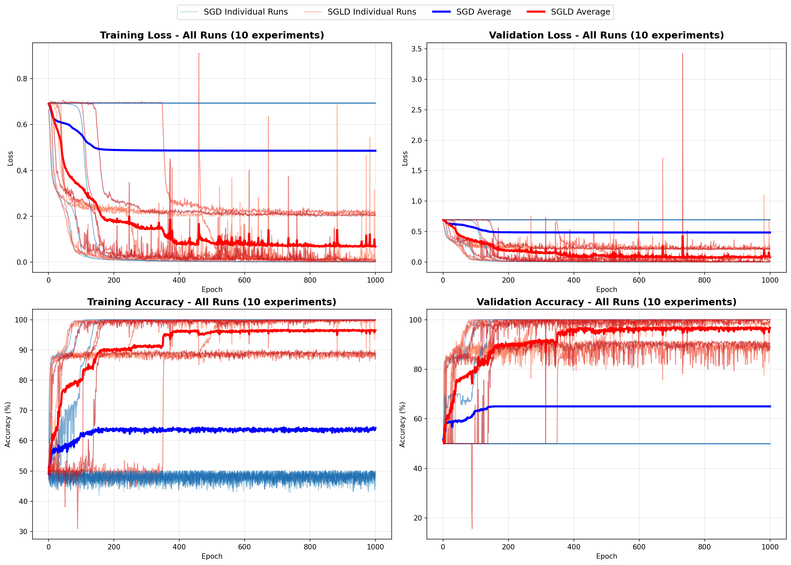
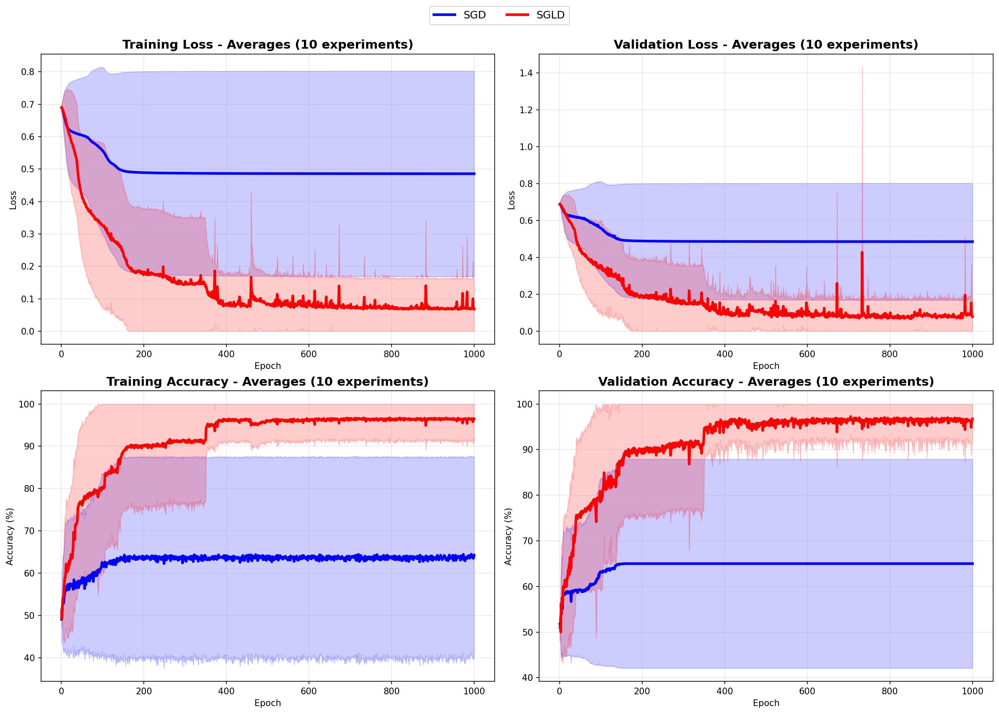

# Moons Experiment: SGD vs. SGLD

This project compares Stochastic Gradient Descent (SGD) and Stochastic Gradient Langevin Dynamics (SGLD) on the non-linear "two moons" dataset. The experiment is designed to show that **SGD is highly sensitive to its starting point**, often getting stuck in local minima, while SGLD's exploratory nature helps it find better solutions regardless of initialization.

## The Setup

We deliberately create a difficult optimization problem to highlight the differences between the two methods.

  * **Model**: A narrow but deep MLP with ReLU activations.
  * **Landscape**: Complex loss surface with many sharp local minima, creating a challenging optimization problem.

## The Method
  * **Sensitivity Test**: SGD's performance is often dictated by its random initialization. To demonstrate this, **SGD and SGLD start with the exact same initial weights** in each of our 10 experimental runs.
  * **Hypothesis**: Because it only follows the gradient, SGD is expected to get trapped in the first poor minimum it finds. SGLD, using injected noise, is less sensitive to the starting conditions, allowing it to escape these traps and explore the landscape more broadly.

## How to Run

Create and activate virtual environment, install dependencies, and run

**On macOS/Linux:**
```bash
python3 -m venv venv
source venv/bin/activate
pip install -r requirements.txt
python experiment.py
```

**On Windows:**
```bash
python -m venv venv
venv\Scripts\activate
pip install -r requirements.txt
python experiment.py
```

The script will run all 10 experiments and print a final summary of the average performance. It also generates two plots visualizing the results: one showing all individual runs and another showing the clean averages with confidence bands.

## Key Configuration

```python
NUM_EXPERIMENTS = 10
NUM_EPOCHS = 1000
LR = 0.01
TEMPERATURE = 0.002
TEMPERATURE_DECAY = 0.999
```

## Example Outputs


*Comparison of SGD vs SGLD across all 10 experimental runs*

 
*Average accuracy over epochs with confidence intervals*